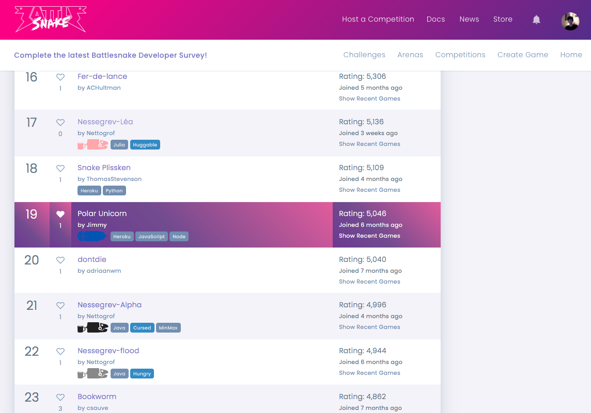

# My highest global ranking (top 10%):

# Design of the snake:
- It is a model that assigns scores to every move and chooses the best one.
- Parameter tweaking can heavily affect the behaviour of the snake.
- Stage 1 filters moves that will hit an obstacle.
- Stage 2 assigns scores for every move based on a local search.
- Stage 3 assigns scores for every move based on a global search with a depth limit.
- The snake eats aggresively until it gets too big.
- In late games, the snake chases tails and avoids bigger snake heads aggressively.

## Local Search:
- Decrements the score by 1 for every immediate obstacles.
- Transforms the score based on immediate foods, rewarding heavily if it's not time to diet or it's starving.
- Transforms the score based on immediate enemies, penalizing heavily if the enemy is not smaller.
- The snake uses this search mainly to avoid getting killed by enemies.

## Global Search:
- Does a BFS with as many steps as the depth limit, which is a non-decreasing function of the game turn.
- Increments the score by 1 for every non-obstacle space explored.
- Transforms the score based on the number of foods explored, rewarding heavily if it's close.
- Transforms the score based on the number of current tails explored, rewarding heavily if it's close.
- Transforms the score based on the number of spaces with nearby bigger snake heads explored, penalizing heavily if it's close.
- The snake uses this search mainly to avoid going into dead ends.

## Notes:
- When doing a global search,
    assigning food and tail chase scores based on proximity is only extreme when a move gets the snake into
    a position where the area ahead is unreachable by other moves;
    otherwise, the assigned score difference is at most 4 among moves.
